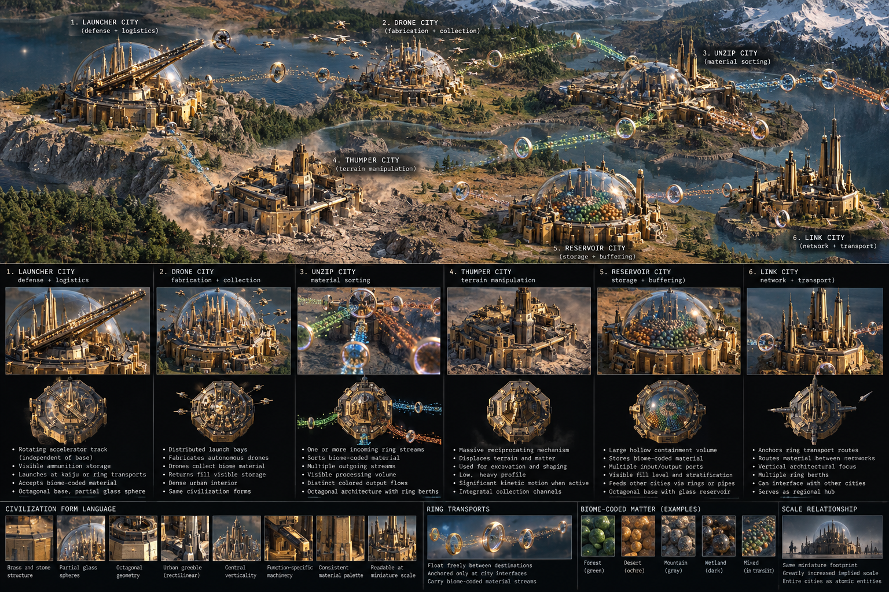

# Six Cities

A miniature civilization simulation about six independently meaningful capabilities composing through shared terrain, matter, logistics, and physical consequence.

Six Cities is one continuous Three.js world rather than six scripted demonstrations. Matter is extracted from terrain, collected, separated, routed, buffered, allocated, and launched while remaining causally continuous across the civilization. The cities differ by function and morphology, but meet through shared world truths instead of pairwise choreography.

The artifact was independently realized from semantic intent and perceptual reference evidence rather than inherited implementation. Its executable and embedded archaeology record the evidence produced along the way.

## Run

Open `index.html` in a modern browser, or visit the GitHub Pages build:

**https://bonoj.github.io/SixCities/**

The artifact is self-contained. Three.js is embedded; it does not fetch renderer, image, or font assets at runtime.

## Read the project

Start with the running artifact.

Then read **[SEMANTIC_SURFACE.md](SEMANTIC_SURFACE.md)** for the current conceptual model: ownership boundaries, earned capabilities, material and network semantics, important failed abstractions, explicit non-claims, and the experiment's stopping condition.

The executable governs present capability. The Semantic Surface interprets what that capability means. Git history preserves how the experiment got there.

## Reference evidence

The morphology board was perceptual and semantic reference evidence for the independent realization: six differentiated functional forms, one civilization language, visible transport grammar, and materially distinct flows. It is evidence used to transmit intent, not an inherited implementation blueprint.

## Status

The Six Cities expedition is complete for its present research purpose.

Its central progression was:

**six named cities → six capabilities → explicit interfaces → shared world truths → emergent composition**
